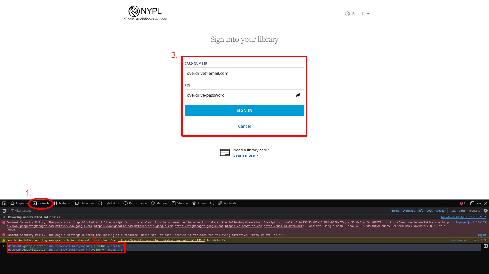

# Multiple Library Card Workaround for Kobo Devices

Hello! This is an up-to-date guide and workaround for the single library restriction on Kobo devices. This guide also gets around the removal of the "Sign in with Overdrive" button, and I tried to make it as clear and easy as possible.

> If you already have an Overdrive account with your library cards already linked and you just want to get around Overdrive removing the account sign-in button, read from [Step 2 - Authenticating with your Overdrive account](#2-authenticating-with-your-overdrive-account)

### Use Libby to borrow books

Though this guide would allow you to sync across any number of libraries, you are still restricted to only one library for borrowing and viewing books from your Kobo device. So you should add your library cards to [Libby](https://libbyapp.com/) as well on a different device for borrowing books, and they should automatically sync once you borrow them from there. Use [this guide](https://help.libbyapp.com/en-us/6103.htm) for that purpose; it should all be straight-forward.

## Requirements

- A computer with a web browser that supports developer tools.  
  Verify this with `Right Click->Inspect` or `Ctrl+Shift+I` (or `Cmd+Option+I` for Mac users). I will be using Firefox throughout this guide, but Chrome/Edge/etc. should work fine as well
- A Kobo device with native Overdrive supported and library cards
- An Overdrive account

### Create an Overdrive Account

Visit this link to create an Overdrive account: https://www.overdrive.com/account/sign-up

> You shouldn't add your library cards from the account settings page here because they won't sync with your Kobo. Instead, we'll be linking them differently in this guide.

## 1. Sign in on your Kobo device

On your Kobo device, go to `More -> Settings -> Overdrive -> Sign in` and then pick a library from among the ones you have a card for. It should then show a link and a code. Input these on your computer and move on to the next step.

> Pick the library card you want to be signed in as for borrowing and viewing books on the Kobo **last**

## 2. Authenticating with your Overdrive account

A few months ago, there used to be an option to sign in directly with your Overdrive account, but that's now been removed. Despite this, the functionality to do this wasn't actually removed from their servers; only the UI element for it was. So you can still login with your Overdrive account by telling it to use an account login instead of a library login from the developer tools.

Use `Right Click->Inspect` or `Ctrl+Shift+I` (`Cmd+Option+I` for Mac users) to open the developer tools menu, then navigate the `Console` tab and run this:

```js
document.querySelector('input[name="librarylogin"]').value = "false";
document.querySelector('input[name="logintype"]').value = "account";
```

> If you don't trust putting this in the console, you can edit this yourself by using the inspector and searching for the `librarylogin` and `logintype` inputs and setting them to `false` and `account` respectively.

Finally, input your Overdrive account email in the "Card Number" field and your password in the "Pin" field and sign in.



## 3. Linking your Library Card

After you've signed in with your Overdrive account, go back to `More -> Settings -> Overdrive` and there should now be an option to add your library card. When adding your library card, **do not use the workaround in the last step** and just add it like you would with only 1 card.

## 4. Repeat

After you've signed in with your library card, **sign out** and repeat back from [step 1](#1-sign-in-on-your-kobo-device). Do this until you have all your library cards linked to your Overdrive account, and remember to enter the library card you want to be signed in as for borrowing and viewing books on the Kobo **last**.

After you've entered your last library card, Kobo should sync across all of them. Give it a try by borrowing a book on Libby and doing a manual sync on your Kobo!

# FAQ

### Sync isn't working after a few weeks/months

Sometimes there are some rare issues with the Overdrive integration that make it stop working after some time. If this happens to you, just log out and log back in using the workaround in the [second step](#2-authenticating-with-your-overdrive-account)

### Adding a new library card

If, after you have done this, you have a new library card, all you have to do is sign out and follow the steps again to link the card. You may also sign out again to switch back to your "main" library with [Step 2](#2-authenticating-with-your-overdrive-account).

### Replacing a library card

Unfortunately, you can't replace a library card without recreating the Overdrive account all over again. You'll have to make a new Overdrive account and follow the guide all over again.

> If you want to use the same e-mail address for the new Overdrive account, you can delete the old one from Overdrive account settings to sign up again with the same e-mail.

## Notes

- You can return the borrowed books from different libraries directly from your Kobo.
- Your Kobo account address has to be in an Overdrive-supported country. It doesn't matter where you are currently located as long as your address is correct.

If you found this guide helpful, consider buying me a coffee: https://ko-fi.com/owlturnedintoaproton

There's no pressure though, I'm just glad that I could help :)